# Relatório Técnico — Suporte de TI

---

## Identificação

| Campo                 | Informação                                        |
| --------------------- | ------------------------------------------------- |
| **Título do Projeto** | Diagnóstico e Resolução de Falha em Servidor DHCP |
| **Data de Execução**  | 24 a 25 de Junho de 2026                          |
| **Responsável**       | Galdino                                           |
| **Ambiente**          | Laboratório Virtual (VirtualBox)                  |
| **Status**            | Concluído                                         |

---

## 1. Objetivo

> Este projeto simula a configuração completa de um servidor DHCP em ambiente Windows Server 2022, desde a instalação da role até a distribuição de endereços IP para clientes na rede. O objetivo é reproduzir um cenário real de suporte para diagnosticar e resolver uma falha de DHCP identificada pelo endereço APIPA em uma máquina cliente. A habilidade de identificar, reproduzir e resolver esse tipo de falha é uma das mais cobradas em posições de suporte de TI nível 1 e 2.

---

## 2. Ambiente do Laboratório

### Infraestrutura Utilizada

| Componente      | Especificação              |
| --------------- | -------------------------- |
| **Hypervisor**  | VirtualBox                 |
| **VM Servidor** | Windows Server 2022        |
| **VM Cliente**  | Windows 11 Pro             |
| **Rede**        | Internal Network — labrede |

### Topologia

```
VM Servidor (192.168.10.2) - Windows Server 2022
       |
    labrede (Internal Network)
       |
VM Cliente (192.168.10.10) - Windows 11 Pro
```

---

## 3. Cenário

> Um usuário entrou em contato com a equipe de suporte informando que não estava conseguindo acessar a internet. Ao verificar a máquina, o técnico percebeu que o endereço IP começava com 169.254, o que imediatamente indicou um problema com o servidor DHCP. Esse tipo de endereço, conhecido como APIPA, é gerado automaticamente pelo Windows quando ele não consegue se comunicar com nenhum servidor DHCP na rede, o que impede o usuário de acessar qualquer recurso da rede corporativa.

---

## 4. Procedimentos Executados

### 4.1 [Configuração do Ambiente]

**Objetivo da etapa:** Criar e configurar as máquinas virtuais que vão simular o ambiente de rede da empresa, conectando-as em uma rede interna isolada.

**Passos executados:**

1. Criação da VM Servidor com Windows Server 2022, 4GB RAM, 50GB Disco
2. Criação da VM Cliente com Windows 11 Pro, 4GB RAM, 40GB Disco
3. Configuração de ambas as VMs com rede interna no VirtualBox (Nome: labrede)

**Evidências:**

> **VM Servidor:**</br></br>
> 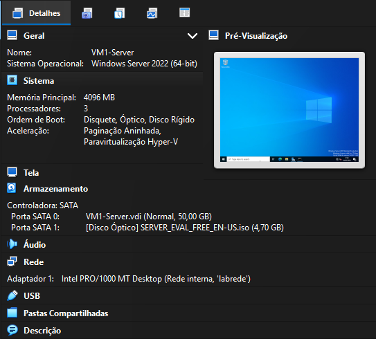

> **VM Cliente:**</br></br>
>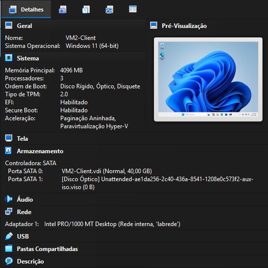

>**IP APIPA:**</br></br>
>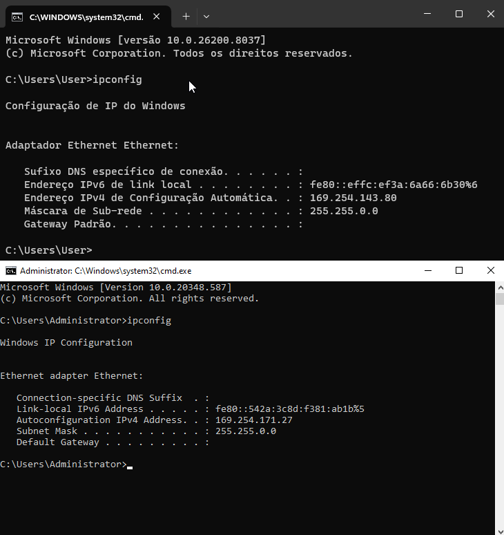

**Resultado:** As duas VMs iniciaram corretamente na rede interna. Como ainda não há servidor DHCP configurado, ambas receberam um endereço APIPA, comportamento esperado nesse estágio, que confirma que a rede interna está funcionando de forma isolada.

---

### 4.2 [Instalação da Role DHCP no Servidor]

**Objetivo da etapa:** Instalar o serviço de DHCP no Windows Server 2022, transformando o servidor em um distribuidor de endereços IP para os dispositivos da rede.

**Passos executados:**

1. No Server Manager, acessar **Manage → Add Roles and Features**
2. Selecionar **Role-based or feature-based installation**
3. Selecionar o servidor de destino na lista - **WIN-IKP7HI5IDNP (VM1-Server)**
4. Marcar **DHCP Server** na lista de roles disponíveis
5. Confirmar a instalação das features adicionais necessárias
6. Aguardar a conclusão da instalação e reiniciar o servidor
7. Após reinicialização, acessar a notificação de conclusão no Server Manager e executar **Complete DHCP Configuration**

**Evidências:**

> **Instalação do DHCP:**</br></br>
> 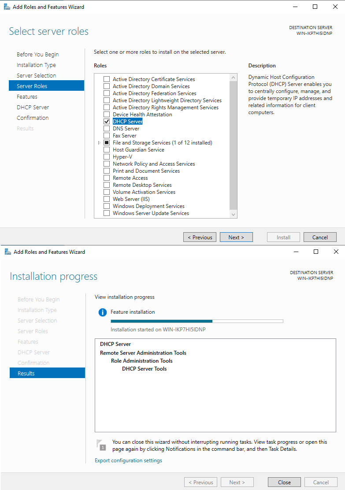

> **DHCP Instalado:**</br></br>
> 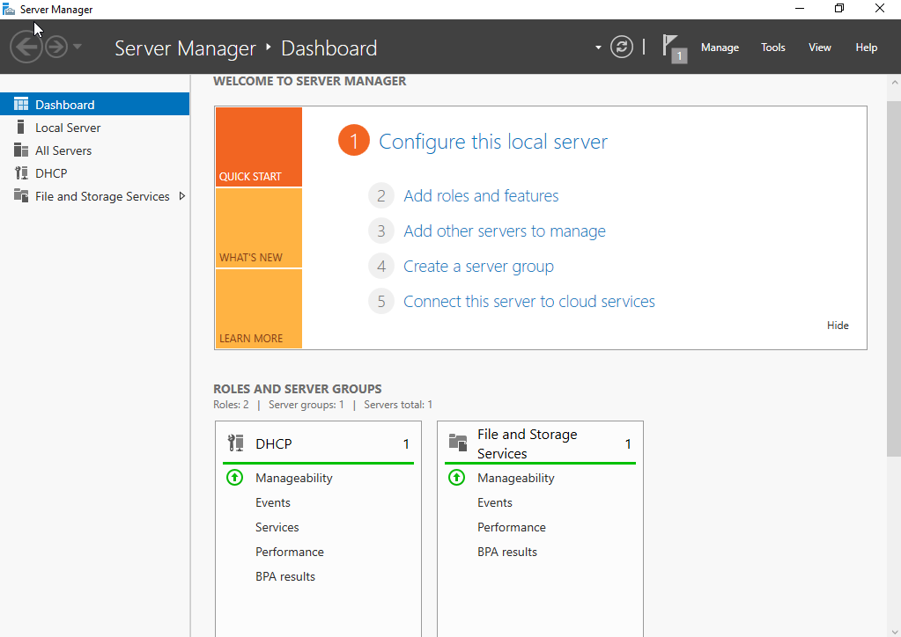

**Resultado:** A role DHCP foi instalada com sucesso no servidor. O serviço aparece no painel do Server Manager com status ativo, indicando que o servidor está pronto para ser configurado como distribuidor de endereços IP na rede.

---

### 4.3 [Configuração do Scope DHCP]

**Objetivo da etapa:** Criar e ativar o escopo de endereços IP que o servidor DHCP vai distribuir para os dispositivos da rede.

**Passos executados:**

1. Acessar **Tools → DHCP** no Server Manager para abrir o console do DHCP
2. Expandir o servidor na árvore à esquerda e clicar com botão direito em **IPv4**
3. Selecionar **New Scope** para abrir o assistente de criação
4. Definir o nome do escopo: **Rede Laboratorio**
5. Configurar o intervalo de IPs:
	- Start IP: `192.168.10.10`
	- End IP: `192.168.10.100`
	- Subnet Mask: `255.255.255.0`

6. Deixar exclusões em branco
7. Manter o Lease Duration padrão de 8 dias
8. Configurar as opções do escopo:	
	- Gateway padrão: `192.168.10.1`
	- DNS: `192.168.10.2`

9. Ativar o escopo ao finalizar o assistente

**Evidências:**

> **Intervalo de IPs:**</br></br>
> 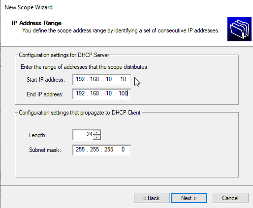

> **Scope Active:**</br></br>
> 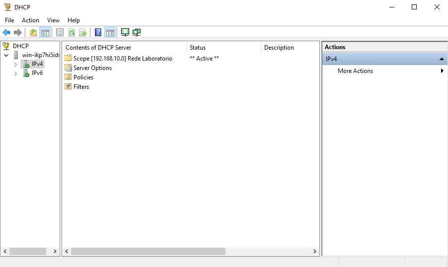

**Resultado:** O escopo foi criado e ativado com sucesso. O servidor DHCP está configurado para distribuir endereços IP na faixa `192.168.10.10` até `192.168.10.100` para os dispositivos conectados na rede `labrede`.

---

### 4.4 [Configuração do IP Fixo no Servidor]

**Objetivo da etapa:** Atribuir um endereço IP fixo ao servidor para garantir que ele sempre seja acessível pelo mesmo endereço de rede, independente do serviço DHCP.

**Passos executados:**

1. Acessar as configurações de rede do servidor via **Painel de Controle → Network and Sharing Center → Change adapter settings**
2. Clicar com botão direito em **Ethernet → Properties**
3. Selecionar **Internet Protocol Version 4 (TCP/IPv4) → Properties**
4. Selecionar **"Use the following IP address"** e preencher:
	- IP address: `192.168.10.2`
	- Subnet mask: `255.255.255.0`
	- Default gateway: `192.168.10.1`
	- DNS: `192.168.10.2`

5. Confirmar com OK e fechar as configurações

**Evidências:**

> **IP Fixo:**</br></br>
> 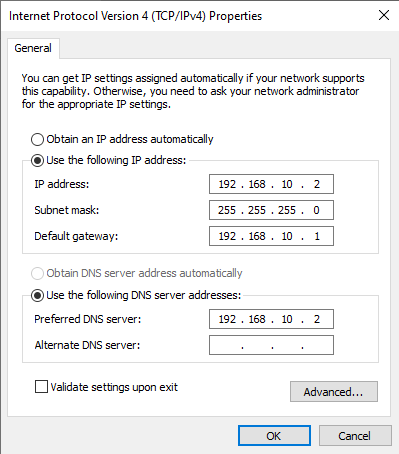


> **Confirmação do IP Fixo:**</br></br>
> 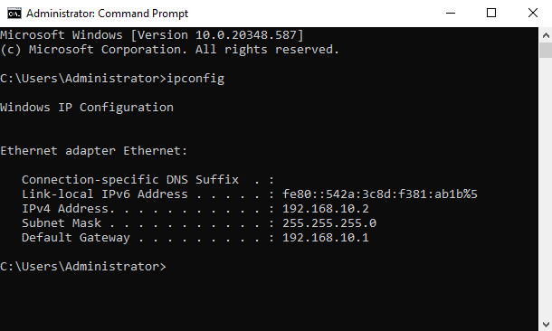

**Resultado:** O servidor passou a operar com o endereço IP fixo `192.168.10.2`, garantindo que os clientes da rede sempre consigam localizá-lo pelo mesmo endereço, independente de reinicializações ou alterações no serviço DHCP.

---

### 4.5 [Validação da Comunicação entre VMs]

**Objetivo da etapa:** Verificar se o servidor DHCP está distribuindo endereços IP corretamente e se as duas VMs conseguem se comunicar pela rede interna.

**Passos executados:**

1. Na VM Cliente, abrir o **cmd** e executar `ipconfig /all`
2. Verificar se o IP recebido está na faixa `192.168.10.x` e se o Servidor DHCP aparece como `192.168.10.2`
3. Executar `ping 192.168.10.2` para testar a comunicação com o servidor
4. Verificar se todos os pacotes foram recebidos sem perda

**Evidências:**

> **Saída no Cliente:**</br></br>
> 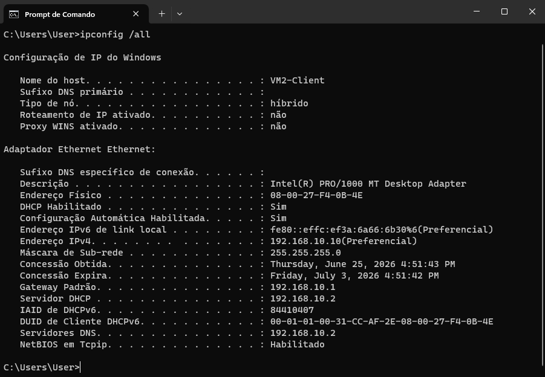

> **Teste de Conectividade:**</br></br>
> 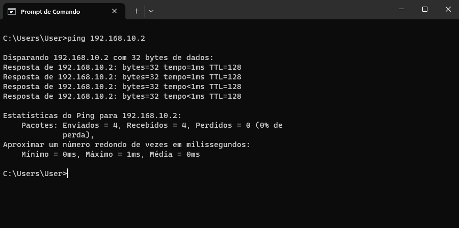

**Resultado:** A VM Cliente recebeu o endereço `192.168.10.10` automaticamente via DHCP e conseguiu se comunicar com o servidor através do ping, confirmando que a rede interna está funcionando corretamente e o serviço DHCP está operacional.

---

## 5. Simulação de Falha

**Falha simulada:** Interrupção do serviço DHCP no servidor, simulando uma falha real onde o servidor para de responder às requisições de endereçamento IP.

**Como foi provocada:**

1. No servidor, acessar **Server Manager → Tools → Services**
2. Localizar o serviço **DHCP Server**
3. Clicar com botão direito → **Stop**
4. No cliente, executar os comandos para forçar a renovação do IP:
	- `ipconfig /release`
	- `ipconfig /renew`

**Comportamento observado:** Após a interrupção do serviço e a renovação forçada, o cliente não conseguiu obter um endereço IP válido do servidor e passou a operar com um endereço APIPA na faixa `169.254.143.80`, perdendo toda a comunicação com a rede.

**Evidências:**

> **Serviço DHCP Interrompido:**</br></br>
> 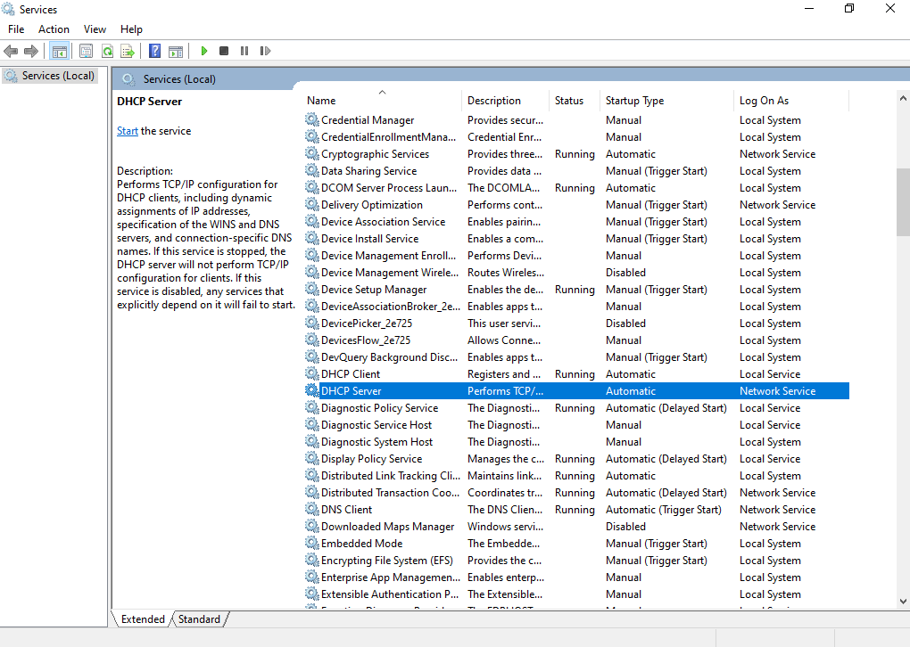

> **Cliente com IP APIPA - Sem Servidor DHCP:**</br></br>
> 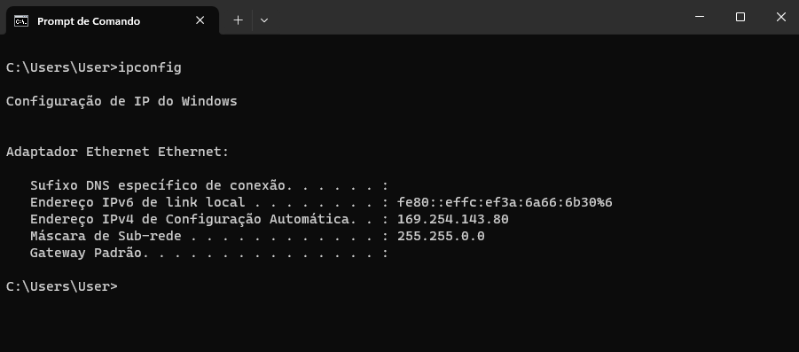

>**Teste de Conectividade - 100% de Perda:**</br></br>
>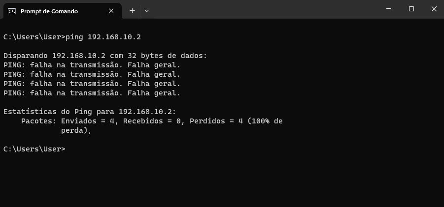

---

## 6. Diagnóstico

**Sintoma identificado:** Cliente com endereço IP na faixa `169.254.x.x` (APIPA) e sem gateway padrão configurado, impossibilitando a comunicação com a rede.

**Causa raiz:** O serviço DHCP Server no servidor estava parado, impedindo que o cliente obtivesse um endereço IP válido ao solicitar a renovação do lease.

**Como identificar esse problema em um ambiente real:** Ao receber um chamado de usuário sem acesso à rede, o primeiro passo é executar `ipconfig` na máquina do usuário. A presença de um endereço iniciando com `169.254` indica imediatamente que o cliente não conseguiu se comunicar com o servidor DHCP. O próximo passo é verificar no servidor se o serviço DHCP está ativo em **Services → DHCP Server → Status**.

---

## 7. Resolução

**Passos para resolução:**

1. No servidor, acessar **Server Manager → Tools → Services**
2. Localizar o serviço **DHCP Server** e clicar com botão direito → **Start**
3. Confirmar que o status voltou para **Running**
4. No cliente, executar `ipconfig /renew` para solicitar um novo endereço IP ao servidor
5. Executar `ipconfig` para confirmar que o IP voltou para a faixa `192.168.10.x`
6. Executar `ping 192.168.10.2` para confirmar que a comunicação foi restabelecida

**Evidências da resolução:**

> **Serviço DHCP Reiniciado:**</br></br>
> 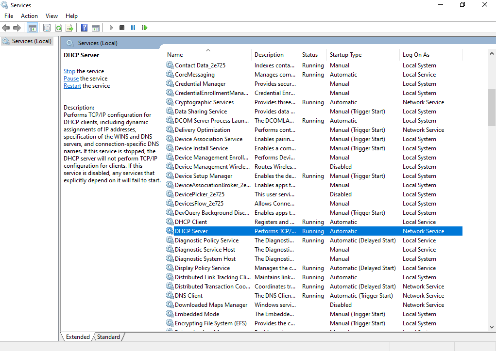

> **IP Restabelecido:**</br></br>
> 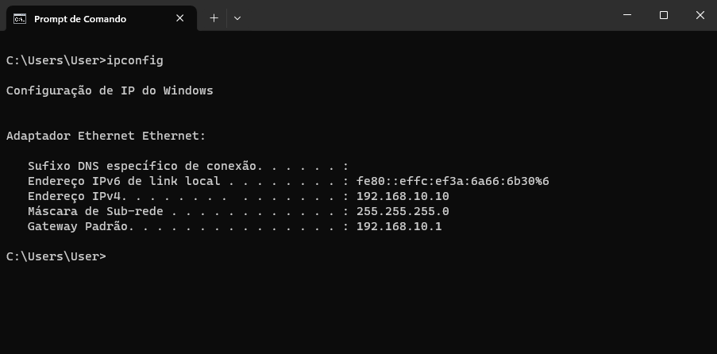

>**Conectividade Restaurada:**</br></br>
>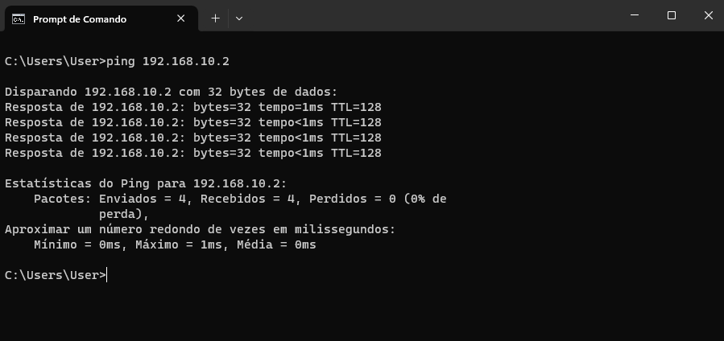

**Tempo de resolução estimado:** Menos de 5 minutos, desde a identificação do APIPA até o restabelecimento da conectividade.

---

## 8. Conclusão

> Um usuário relatou perda de acesso à rede corporativa. Ao verificar a máquina, o técnico identificou um endereço IP iniciando com `169.254`, característica do APIPA, que indica que o computador não conseguiu se comunicar com o servidor responsável por distribuir endereços IP na rede. Após verificar o servidor, constatou-se que o serviço DHCP estava parado. O serviço foi reiniciado e o cliente solicitou um novo endereço IP, restabelecendo a conectividade em menos de 5 minutos.

---

## 9. Lições Aprendidas

- Um endereço IP iniciando com `169.254` é o primeiro indicador de falha no serviço DHCP e deve ser o ponto de partida do diagnóstico.
- O comando `ipconfig /release` seguido de `ipconfig /renew` é a forma mais rápida de forçar a renovação do endereço IP e confirmar se o servidor DHCP está respondendo.
- Serviços críticos como o DHCP devem ser monitorados continuamente em ambiente de produção para evitar interrupções para os usuários.

---

## 10. Referências e Ferramentas Utilizadas

| Ferramenta          | Finalidade                                    |
| ------------------- | --------------------------------------------- |
| VirtualBox          | Criação e gerenciamento das máquinas virtuais |
| Windows Server 2022 | Servidor DHCP do laboratório                  |
| Windows 11 Pro      | Máquina cliente para testes                   |
| CMD (ipconfig)      | Diagnóstico e renovação de endereço IP        |
| Services (Windows)  | Gerenciamento do serviço DHCP                 |
| PowerShell          | Configuração de regras de firewall            |

---

*Documento gerado como parte do laboratório prático de Suporte de TI — Portfólio Galdino*
