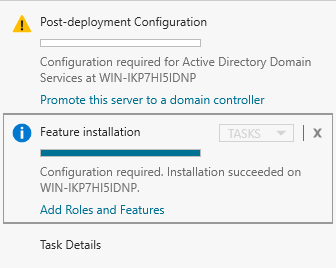
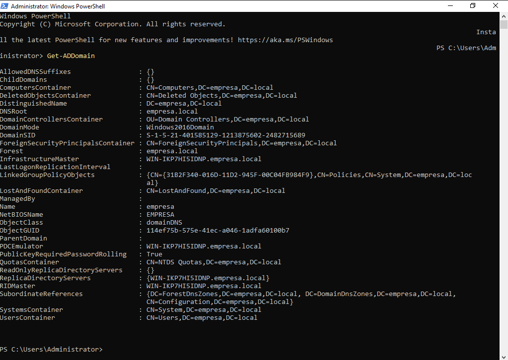

# 🔬 Projeto 2 — Active Directory: Gestão do Dia a Dia

## 📋 Identificação

| Campo                 | Informação                            |
| --------------------- | ------------------------------------- |
| **Título do Projeto** | Active Directory: Gestão do Dia a Dia |
| **Data de Execução**  | 30 de Junho de 2026                   |
| **Responsável**       | Galdino                               |
| **Ambiente**          | Laboratório Virtual (VirtualBox)      |
| **Status**            | Em andamento                          |

---

## 1. Objetivo

>Promover o Windows Server 2022 a Domain Controller, estruturar o domínio com Organizational Units e grupos de segurança, e executar os quatro tickets de suporte mais recorrentes no dia a dia de TI: reset de senha, desbloqueio de conta, transferência de departamento e desligamento de funcionário.

---

## 2. Ambiente do Laboratório
### Infraestrutura Utilizada

| Componente      | Especificação              |
| --------------- | -------------------------- |
| **Hypervisor**  | VirtualBox                 |
| **VM Servidor** | Windows Server 2022        |
| **VM Cliente**  | Windows 11 Pro             |
| **Rede**        | Internal Network — labrede |
| **Domínio**     | empresa.local              |
| IP do DC        | 192.168.10.2 (Fixo)        |

### Topologia

```
[VM1-Server] (192.168.10.2)
   Domain Controller (empresa.local)
        |
   [labrede] (Internal Network, VirtualBox)
        |
[VM2-Client] (Windows 11 Pro)
```

---

## 3. Cenário

>Um funcionário esqueceu a senha e está bloqueado. Outro foi transferido de departamento e precisa de acesso a novas pastas. Um terceiro saiu da empresa e a conta precisa ser desativada. Três tickets na mesma fila, mesmo dia.

---

## 4. Procedimentos Executados

### 4.1 [Promoção do servidor a Domain Controller]

**Objetivo da etapa:** instalar o role Active Directory Domain Services e promover o servidor a controlador de domínio, criando a floresta empresa.local.

**Passos executados:**

1. **Server Manager → Add Roles and Features → Active Directory Domain Services**
2. Após instalação do role, acessar a notificação **Promote this server to a domain controller**
3. Em **Deployment Configuration**, selecionar **Add a new forest** e definir o root domain name como `empresa.local`
4. Definir a senha de DSRM (Directory Services Restore Mode)
5. Ignorar os avisos de delegação de DNS e compatibilidade com Windows NT 4.0 (esperados em domínio isolado, sem ação necessária)
6. Confirmar a instalação. O servidor reinicia automaticamente ao final

**Evidências:** 

> **Role Instalado:**</br></br> 
>   

> **Promoção Concluída:**</br></br>

**Resultado:** O domínio `empresa.local` foi criado com sucesso e o servidor passou a operar como Domain Controller. A promoção foi confirmada via PowerShell com o comando `Get-ADDomain`, retornando `DNSRoot: empresa.local`, `NetBIOSName: EMPRESA` e `DomainMode: Windows2016Domain`.

---

## 🔍 Diagnóstico


---

## ✅ Resolução


---

## 📝 Conclusão


---

## 💡 Lições Aprendidas


---

## 📚 Referências e Ferramentas

| Item | Link |
|---|---|
| | |
